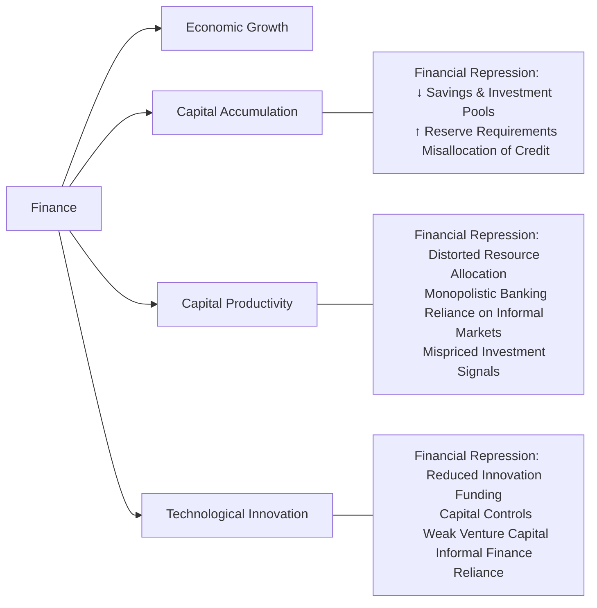

```mermaid
flowchart LR
    F["Finance"] --> G["Economic Growth"]

    F --> A["Capital Accumulation"]
    F --> B["Capital Productivity"]
    F --> C["Technological Innovation"]

    A --- A_sub["Financial Repression: 
    ↓ Savings & Investment Pools
    ↑ Reserve Requirements
    Misallocation of Credit"]

    B --- B_sub["Financial Repression: 
    Distorted Resource Allocation
    Monopolistic Banking
    Reliance on Informal Markets
    Mispriced Investment Signals"]

    C --- C_sub["Financial Repression: 
    Reduced Innovation Funding
    Capital Controls
    Weak Venture Capital
    Informal Finance Reliance"]

```
