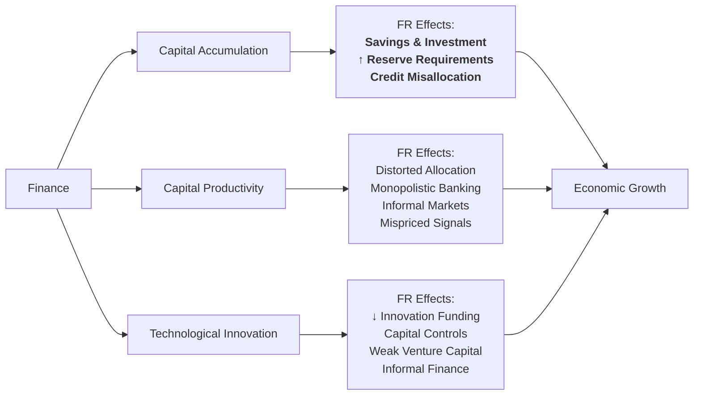

```mermaid
flowchart LR
    F["Finance"]

    %% Channels
    A["Capital Accumulation"]
    B["Capital Productivity"]
    C["Technological Innovation"]

    %% FR Effects (multiline, single line per item)
    A_sub["FR Effects:<b></br> Savings & Investment\n↑ Reserve Requirements\nCredit Misallocation"]
    B_sub["FR Effects:\nDistorted Allocation\nMonopolistic Banking\nInformal Markets\nMispriced Signals"]
    C_sub["FR Effects:\n↓ Innovation Funding\nCapital Controls\nWeak Venture Capital\nInformal Finance"]

    %% Flow connections
    F --> A --> A_sub --> G["Economic Growth"]
    F --> B --> B_sub --> G
    F --> C --> C_sub --> G

```
