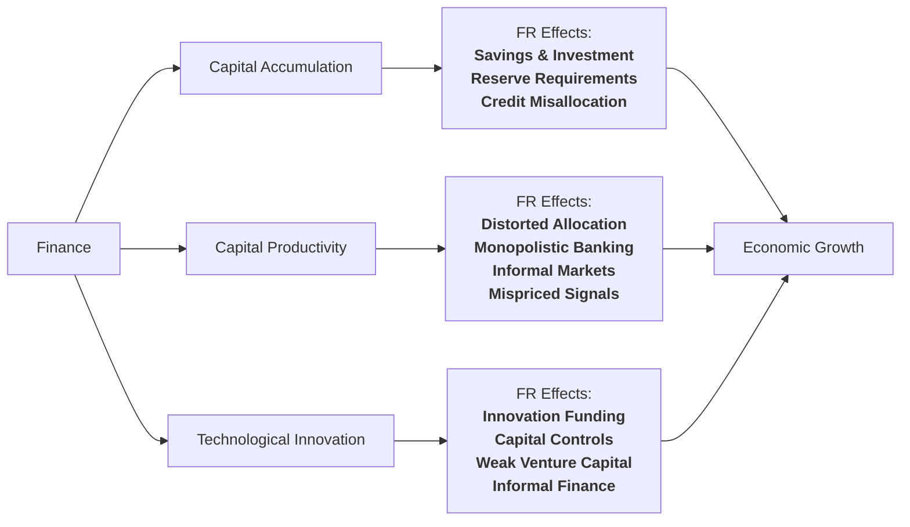

```mermaid
flowchart LR
    F["Finance"]

    %% Channels
    A["Capital Accumulation"]
    B["Capital Productivity"]
    C["Technological Innovation"]

    %% FR Effects (multiline, single line per item)
    A_sub["FR Effects:<b></br> Savings & Investment<b></br> Reserve Requirements<b></br> Credit Misallocation"]
    B_sub["FR Effects:<b></br> Distorted Allocation<b></br> Monopolistic Banking<b></br> Informal Markets<b></br> Mispriced Signals"]
    C_sub["FR Effects:<b></br> Innovation Funding<b></br> Capital Controls<b></br> Weak Venture Capital<b></br> Informal Finance"]

    %% Flow connections
    F --> A --> A_sub --> G["Economic Growth"]
    F --> B --> B_sub --> G
    F --> C --> C_sub --> G

```
