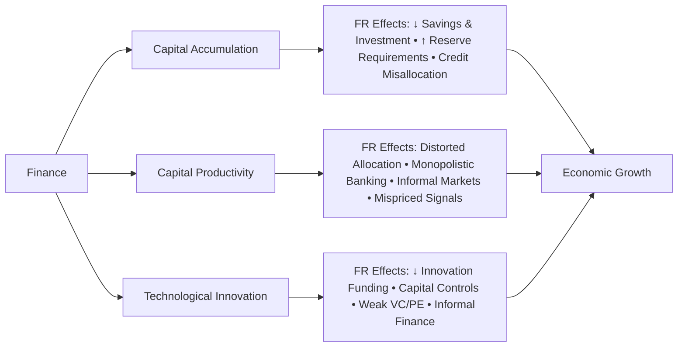

```mermaid
flowchart LR
    F["Finance"]

    %% Channels
    A["Capital Accumulation"]
    B["Capital Productivity"]
    C["Technological Innovation"]

    %% FR Effects (act as connectors to Growth)
    A_sub["FR Effects: ↓ Savings & Investment • ↑ Reserve Requirements • Credit Misallocation"]
    B_sub["FR Effects: Distorted Allocation • Monopolistic Banking • Informal Markets • Mispriced Signals"]
    C_sub["FR Effects: ↓ Innovation Funding • Capital Controls • Weak VC/PE • Informal Finance"]

    %% Flow connections
    F --> A --> A_sub --> G["Economic Growth"]
    F --> B --> B_sub --> G
    F --> C --> C_sub --> G

```
