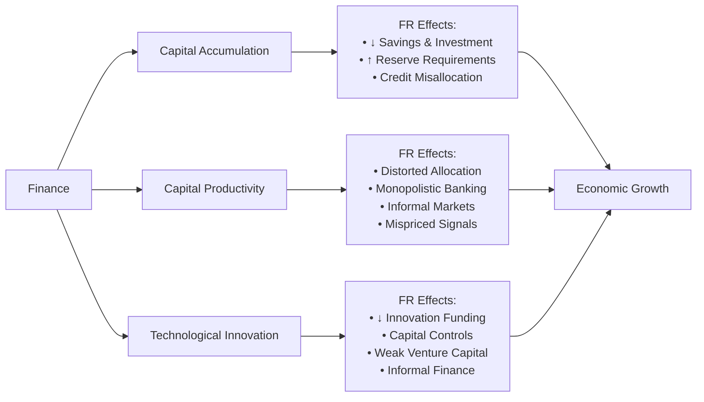

```mermaid
flowchart LR
    F["Finance"]

    %% Channels
    A["Capital Accumulation"]
    B["Capital Productivity"]
    C["Technological Innovation"]

    %% FR Effects (multiline with bullets)
    A_sub["FR Effects:\n• ↓ Savings & Investment\n• ↑ Reserve Requirements\n• Credit Misallocation"]
    B_sub["FR Effects:\n• Distorted Allocation\n• Monopolistic Banking\n• Informal Markets\n• Mispriced Signals"]
    C_sub["FR Effects:\n• ↓ Innovation Funding\n• Capital Controls\n• Weak Venture Capital\n• Informal Finance"]

    %% Flow connections
    F --> A --> A_sub --> G["Economic Growth"]
    F --> B --> B_sub --> G
    F --> C --> C_sub --> G

```
