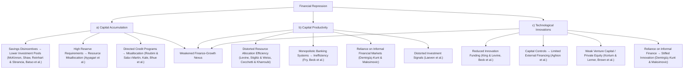

```mermaid
flowchart TD
    FR["Financial Repression"] --> A["a) Capital Accumulation"]
    FR --> B["b) Capital Productivity"]
    FR --> C["c) Technological Innovations"]

    %% Capital Accumulation
    A --> A1["Savings Disincentives → Lower Investment Pools (McKinnon, Shaw, Reinhart & Sbrancia, Batuo et al.)"]
    A --> A2["High Reserve Requirements → Resource Misallocation (Ayyagari et al.)"]
    A --> A3["Directed Credit Programs → Misallocation (Roubini & Sala-i-Martin, Kale, Bhue et al.)"]

    %% Capital Productivity
    B --> B1["Distorted Resource Allocation Efficiency (Levine, Stiglitz & Weiss, Cecchetti & Kharroubi)"]
    B --> B2["Monopolistic Banking Systems → Inefficiency (Fry, Beck et al.)"]
    B --> B3["Reliance on Informal Financial Markets (Demirgüç-Kunt & Maksimovic)"]
    B --> B4["Distorted Investment Signals (Laeven et al.)"]

    %% Technological Innovation
    C --> C1["Reduced Innovation Funding (King & Levine, Beck et al.)"]
    C --> C2["Capital Controls → Limited External Financing (Aghion et al.)"]
    C --> C3["Weak Venture Capital / Private Equity (Kortum & Lerner, Brown et al.)"]
    C --> C4["Reliance on Informal Finance → Stifled Innovation (Demirgüç-Kunt & Maksimovic)"]

    %% Outcome
    A --> G["Weakened Finance-Growth Nexus"]
    B --> G
    C --> G

```
